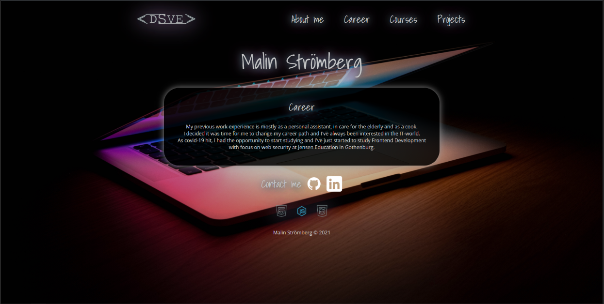
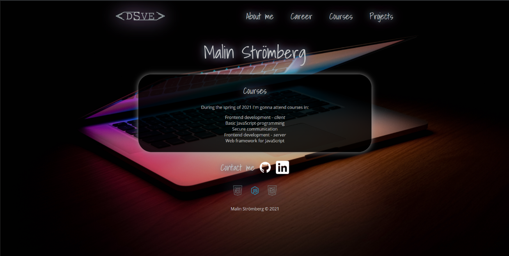
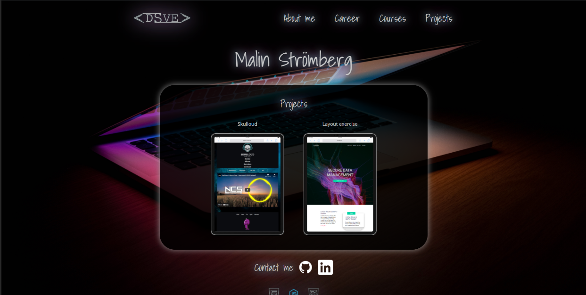

# API Assignment

## Content

- [Assignment](#assignment)
    - [Criteria](#criteria)
        - [Grade G](#grade-g)
        - [Grade VG](#grade-vg)

- [Plan](#plan)
    - [List](#list-of-things-that-should-be-in-project)
        - [Header](#header)
        - [Main](#main)
        - [Footer](#footer)
- [Other](#other)
- [Links](#links)
- [Result](#result)

# Assignment

Create a webapplication  that shows information from an external website using JavaScript and fetch.

## Criteria

### Grade G
- [x] Fetch data from API
- [x] Vanilla JavaScript
- [x] Semantic HTML
- [x] Flexbox or CSS Grid.
- [x] Media queries

### Grade VG

- [x] The student fills all criteria from grade G.
- [x] Search function with async
- [x] The student implements advanced CSS or JavaScript animations.

# Plan

## List of things that should be in project:

### Header:

- Header with name

### Main:

- Random namegenerator
- Search function

#### Footer:

- Links to LinkedIn & GitHub
- Copyright 2021

### Other

- 

## Links

- [Background](https://unsplash.com/photos/SyYmXSDnJ54)
  
- [Iconfinder](https://www.iconfinder.com/)
- [Entypo](http://www.entypo.com/)

## Result
- [Portfolio](http://www.malin.dsve.se)
  
  
  
  