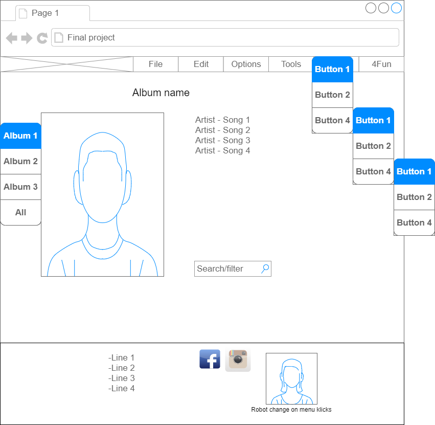
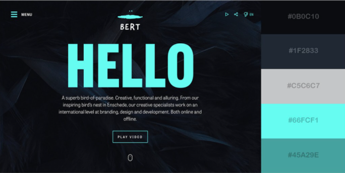

# Final Project HTML, CSS, JavaScript

## Assignment and requirements
Build a website where you can view a list of 15-20 songs (imagine it being used like a streaming-service).

The list should contain both artist and song name, in that order.

All files/images/icons should be organised in folders and mapped according to best practises in the project.

### HTML
Create correct semantic HTML templates/structure.

1. Header with logo and a 3-level-menu, meaning Menu-Submenu-Submenu. [x]
2. Banner with image and text. [x]
3. Song list, and a search field. [x]
4. Section with shortcuts to other subpages, social media (with icons) and logo. [x]
5. Footer [x]

### CSS
1. The site should be responsive. [x]
2. The site should have a clean design with a maximum of five colors. [x]
3. The site should have a couple of visual effects, for example:
    - shadows [x]
    - visual changes on mouse hover [x]
    
### JavaScript
1. The content of the website should be dynamic (titles, content and style changes) and changeable with JavaScript.
2. You should be able to read data from a mocked database. [x]
3. You should be able to search/filtrate information with JavaScript (search songs in playlist) [x]

### Other not mentioned requirements

#### Grade G
- Frontend should talk with a server. [x]
- Semantic HTML Syntax [x]
- Correct syntax with CSS [x]
- Responsive layout with dynamic components [x]
- Use JavaScript to get data from an API and display data. [x]

#### Grade VG
- The student should show a bigger understanding of how HTML, CSS and JavaScript works together on a modern webpage, trough own research and implementations in this assignment. [x]

## Plan
Make a responsive website with a navbar, main and a footer.

### Navbar
Will contain the required menu.
- Header and logo
    - Header [x]
    - Logo [x]
- Menu with 2 extra levels of sub-menu.
    - Level 0 [x]
    - Level 1 [x]
    - Level 2 [x]

### Main 
Will contain Album with Artist and playlist.
- Image of Album [x]
- Song list [x]
- Search field [x]

### Footer
Will contain a section with links to other pages and social media.
- Shortcuts to other pages. [x]
- Links to companies with Icons for respective company.
    - Instagram [x]
    - Facebook [x]
    - Other [x]
- Show random robot picture, generated from a web API. [x]

## Responsive design
Should look good on:
- Phone [x]
- Tablet [x]
- Computer [x]

## CSS
- Make a nice looking website. [x]
- Use id, class and semantic tags in styles files. [x]
- Use of 5 complement colors. [x]
- On hover of links invert or somehow highlight selection. [x]
- Lock up some kind of transition on image hover or maybe on change of page. [x]

## JavaScript
- Save Album info in a JSON file and read dynamic data from two or three Albums. [x]
- Search functionality that filter the songs. [x]

## Rough sketch/idea of final result

### Wireframe
 

### Color Scheme

## Resources
### HTML & CSS
- Semantic [HTML](https://www.w3schools.com/html/html5_semantic_elements.asp)
- Navbar - [Subnav](https://www.w3schools.com/howto/howto_css_subnav.asp)
- Fonts [from google fonts](https://fonts.google.com/)
- Design [logo](https://www.designevo.com/)
- Google for [images & track lists](https://www.google.com/)
- 

### JavaScript
- JavaScript HTML DOM [Changing HTML](https://www.w3schools.com/js/js_htmldom_html.asp)
- JavaScript HTML DOM [EventListener](https://www.w3schools.com/js/js_htmldom_eventlistener.asp)
- Load JSON file locally using pure [Javascript](https://codepen.io/KryptoniteDove/post/load-json-file-locally-using-pure-javascript)
- How to use [JSON with JavaScript](https://www.quackit.com/json/tutorial/json_with_javascript.cfm)
- Build a [JSON file](https://stackoverflow.com/questions/46697129/i-am-trying-to-store-a-music-album-using-json)

### Other
- [Shields.io](https://shields.io/) for badges in footer to Facebook and other badges

### Extra API with fetch()
- [Source JsonPlaceHolder](http://jsonplaceholder.typicode.com/?fbclid=IwAR32uP0r5T-awDAoKc50JCjjgY5qvOaOlZF0s6wJ1L9Al4enPUtqID0aM7g)
- [Album JSON data](http://jsonplaceholder.typicode.com/albums)
- [User JSON Data](http://jsonplaceholder.typicode.com/users)

## Result
