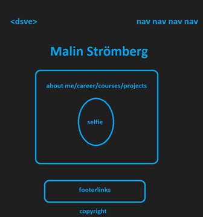

# End project HTML & CSS

## Content

- [Assignment](#assignment)
    - [Criteria](#criteria)
        - [Grade G](#grade-g)
        - [Grade VG](#grade-vg)

- [Plan](#plan)
    - [List](#list-of-things-that-should-be-in-project)
        - [Header](#header)
        - [Main](#main)
        - [Footer](#footer)
- [Other](#other)
- [Links](#links)
- [Result](#result)
  

# Assignment

Create a portfolio-site with HTML and CSS with own design. Only use CSS Grid/Flexbox and media queries.

- Design a mockup
- Develop modern site from mockup, implement nice design
- Link to website trough GitHub-pages

## Criteria

### Grade G

- Semantic HTML
- CSS Grid and Flexbox
- Media queries
- Web Accessibility

### Grade VG

- The student fills all criteria from grade G.
- The student implements further things that the teacher has not gone through in class.

# Plan

## List of things that should be in project:

### Header:

- Header with name
- Navigation with logo

### Main:

- Personal information
- Picture
- Previous work experience
- Courses
- Projects

#### Footer:

- Links to LinkedIn & GitHub
- Copyright 2021

### Other

- Make mockup
  - 
- Develop semantic HTML and CSS
- Make it responsive with media queries

## Links

- [Background](https://unsplash.com/photos/SyYmXSDnJ54)

- [Iconfinder](https://www.iconfinder.com/)
- [Entypo](http://www.entypo.com/)

## Result
- [Portfolio](http://www.malin.dsve.se)

